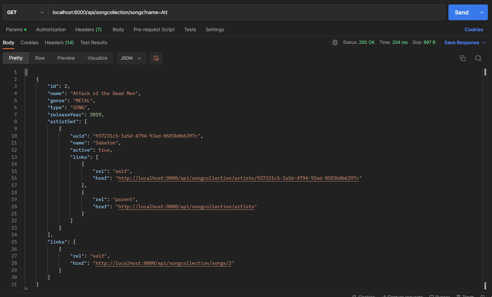
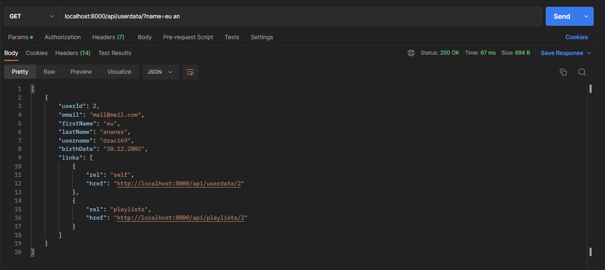

----------------------------------------------------------

# Prezentare  

Proiectul prezinta pe partea de back-end cam toate functionalitatile cerute, precum toate operatiile CRUD pe serviciile REST (artists, songs, userdata, playlists), cu HATEOAS si cu toate filtrele ca si query params, si toate CRUD pentru SOAP(IDM). Serviciile de artists si songs au fost separate si s-a adaugat in plus un serviciu de date personale ale fiecarui utilizator. S-a folosit bazele de date MySQL(artists, songs, idm) si Mongo(playlists, userdata). MySQL are un [script de initializare](ops/scripts/init.sql) cand nu exista deja un volum creat de container.

MySQL  
  
  
Mongo  
  

Toate cererile trec printr-un serviciu tip Gateway care este responsabil de a autentifica si autoriza un user(folosind JWT-uri si serviciul de IDM). Daca user-ul are dreptul sa faca respectiva cerere, ea va fi trimisa la serviciul corespunzator care va intoarce un rezultat la apelant.  

Roluri:  
  

Exemplu log-uri Get song by id:  

  

Toate serviciile ruleaza in containere de docker. Imaginile pentru servicii au fost create folosind plugin-ul de docker din [pom](pom.xml) si apoi a fost creat un [docker-compose](ops/docker-compose.yml).  

  

Se observa si un container de prometheus si unul de alertmanager. Prometheus are rolul de a prelua metrici de la servicii si de a verifica daca inca sunt active. Cand unul din servicii este offline, se va trimite pe mail o alerta cu serviciul care a picat. [Configurari prometheus](ops/prometheus).

Prometheus:  
  

Prometheus, serviciu picat:  
  

Prometheus, alerta:  
  

Alerta in gmail:  
  

Un user trebuie prima oara sa se logheze pentru a obtine un jwt, pe care il va folosi intr-un header "Authorization: Bearer _jwt_" la toate request-urile viitoare pentru a avea acces, altfel va primi ca raspuns 403 (_Forbidden_). Poate face logout oricand, invalidand token-ul.  

Login:  
  

Invalid/No JWT/Permisiuni incorecte pentru request:  
  

Logout:  
  

Dupa logout(acelasi token):  
  

Avand un jwt, se pot face request-uri la gateway, care va face forward la serviciul potrivit (daca are permisiuni). Pentru a vedea interfata unui serviciu, se poate obtine fisierul de open-api la adresa /api/docs sau se poate vedea interfata swagger.  

Open-API:  
  

Swagger:  
  

Exemple request-uri REST(+ HATEOAS):  

Get songs:
  
Get song by id:  
  
Post song:
  
Put song - create:  
  
Delete song:
  
Get songs of artist:  
  
Paginare:  
  
Filtru gen muzical pe songs:  
 
Put song - update:  
  
Filtru gen muzical pe songs:  
  
Filtru nume pe songs:  
 
Filtru nume EXACT pe songs:  
 
Filtrul de nume pentru serviciul de userdata nu tine cont daca numele e exact sau de ordinea de First Name si Last Name:  
  
  

Serviciul IDM este un serviciu SOAP care se ocupa de JWT-uri (creare, verificare) si de users(CRUD). A fost integrat si el in Gateway, care expune un API(un wrapper practic) de tip REST pentru a facilita utilizarea sa.  

WSDL(la adresa: localhost:8001/soapUserService/users.wsdl):  
  
Validate token in IDM:  
  
REST get user by id prin Gateway:  
  

Gateway-ul are rolul de a trimite jwt-ul la IDM pentru a fi verificat si dezpachetat. Daca este valid, se primeste id-ul user-ului si rolurile sale. Apoi sa verifica daca are permisiuni acel user pntru respectiva cerere facuta sau daca lucreaza pe un obiect propriu(De exemplu, daca vrea sa isi modifice propriile date personale, nu se pot modifica datele altcuiva). S-a folosit Spring Security pentru asta.  

Baza de date pt token. Se verifica daca token-ul este in BD, altfel este invalid(de exemplu, la logout, se sterge din bd facand-ul invalid):  
  
Forbidden cand se modifica datele altui user:  
User id: 2  
  
Modificare date ale user cu id 3:  
  

Interfata a fost realizata cu framework-ul React. Voi lasa acum cateva screenshot-uri cu interfata:  
Login:  
  
Login autentificare esuata:  
  
User info:  
  
Playlist-uri proprii:  
  
Detalii playlist:  
  
Artists:  
  
Detalii artist:  
   
Adaugare artist:   
  
Songs:  
  
Detalii melodie:  
  
Adaugare melodie:  
  
Filtrare melodii
  